# MARKDOWN FILE
---
**1.**  
---
**( a.) Display the path of your current directory**  

  

---

**( b.) List out the contents of your current directory**  

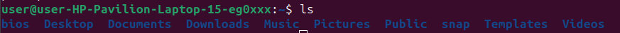

---

**( c.) List out the contents of your current directory including hidden files**  

---

**2.**  
---
**( a.) Create a new directory named *a***  

---

**( b.) Move to the newly created directory a**  

---

**( c.) Create a blank file named *“file1”***  

---

**( d.) Display the file type of *“file1”***

---

**( e.) Add the line “Hello World” to *“file1”* using the command echo**

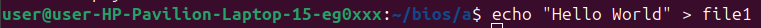

---

**( f.) Display the contents of *“file1”***

---

**( g.) Display the file type of *“file1”* again**

---

**3.**
---
**( a.) Stay in directory *a*. Create a file *“file2”* and add the contents below using the  command `cat`**

***First Line Second Line Third Line***

---

**( b.) Display the contents of *“file2”***

---

**( c.) Display the contents of *“file2”* with the lines reversed**

---

**4.**
---
**( a.) Stay in directory *a*. Concatenate the contents of *“file1”* and *“file2”* and save them into a new file *“file3”***

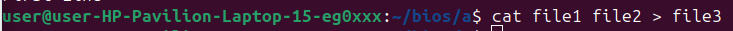

---

**( b.) Display the contents of *“file3”***

---

**5.**
---
**( a.) Stay in directory *a*. Create 2 directories *b/c* with a single command**

---

**( b.) Create a new directory *d***

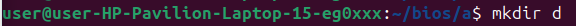

---

**( c.) Copy the directory *d* to directory *c* using a single command**

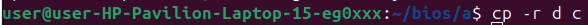

---

**( d.) Delete the directory *d* in the current directory *a***

---

**( e.) Copy *“file3”* to the directory *d* with a single command**

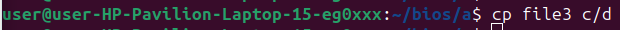

---

**6.**
---
**( a.) Go to directory *d* and rename *“file3”* to *“file0”***

---

**(b.)Stay in the same directory and move *“file0”* to directory *a***

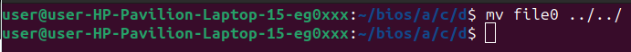

---

***7.***
---
**( a.) Go to your home directory**

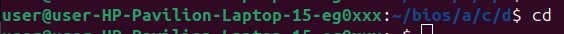

---

**( b.) Create a file named *“test”* in the directory *a/b/c/d***

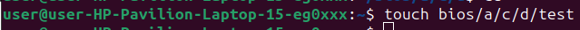

---

**( c.) Stay in the home directory. Find and display the path of *“test”***

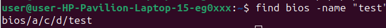

---

***8.***
---
**( a.) Go to directory *a*. Get the man page of grep and save its contents to a file named *“grepman.txt”***

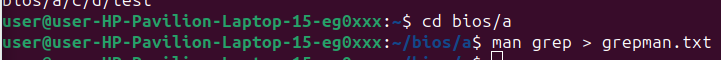

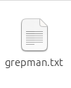

---

**( b.) Print the lines containing the word *“FILE”* (Case sensitive) in the file *“grepman.txt”***

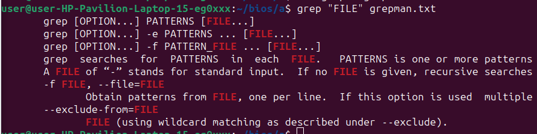

---

***9.***
---
**( a.) Go to directory *a* and remove the directory *b* with a single command**

---

**(b.) Remove the files starting with the word *“file”* with a single**

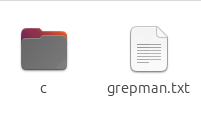

---

***10.***
---
**( a.) Go to https://blog.bi0s.in/  and download the *logo.png* image using `wget`**

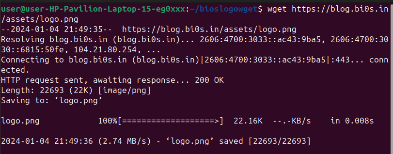

---

**(b.) Do the same with python script (Hint : request library)**

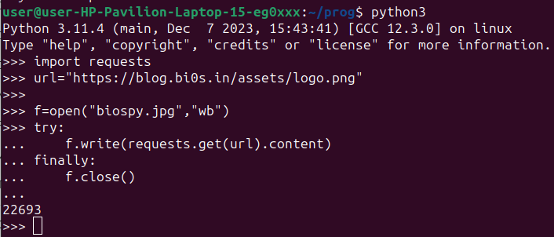

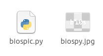

---

**(c.) Also, display the metadata of the png.**

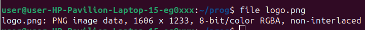

---
